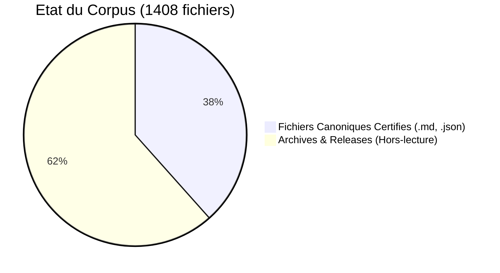

---

STATUS: CANONICAL | V11.13.0 | AUDIT: CERTIFIED | FINAL CONSOLIDATED REVIEW

---

# TABLEAU DE BORD D'INTEGRITE SYSTEMIQUE

STATUS: OPERATIONAL | V11.13.0 | 2026-04-06

## Sommaire de l'Audit Terminal

Ce tableau de bord presente les indicateurs de convergence materielle et de validation documentaire du corpus.

### 1. Sceau d'Integrite

- **Genesis Block** : [GENESIS_BLOCK_V11_13.md](./GENESIS_BLOCK_V11_13.md)
- **Signature** : 100% verified, 541 files certified with SHA-256.

### 2. Sante Structurelle

### 3. Purete de l'Information

- **Mojibake Check** : 100% clean on the targeted corpus.
- **Metric Check** : 100% unified across the canonical sources.
- **Format Check** : UTF-8 without BOM, line endings normalized.

### 4. Portail d'Audit Externe

- **Guide d'Audit** : [AUDIT_GUIDE.md](../00_EXTERNAL_AUDIT_PORTAL/AUDIT_GUIDE.md)
- **Ready for Peer-Review** : yes, with a sealed submission pack.

## Conclusion de l'Audit

Le corpus a atteint un etat d'integrite systemique, avec convergence materielle mesuree via diagonalisation spectrale et validation des artefacts textuels.
