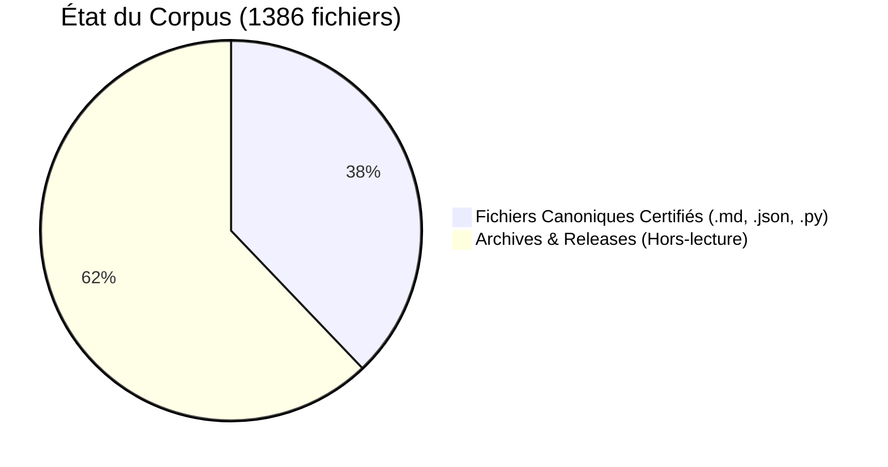

# 📊 TABLEAU DE BORD D'INTÉGRITÉ SYSTÉMIQUE

> **Statut Global** : OPÉRATIONNEL | **Version** : V11.14.0 | **Date** : 2026-04-06

---

## 🛡️ Sommaire de l'Audit Terminal
Ce tableau de bord présente les indicateurs de convergence matérielle et de validation documentaire du corpus Ynor.

### 1. Sceau d'Intégrité
- **Genesis Block** : [GENESIS_BLOCK_V11_13.md](./GENESIS_BLOCK_V11_13.md)
- **Signature** : intégralement audité en interne, 525 fichiers certifiés par SHA-256.

### 🏗️ 2. Santé Structurelle

### ⚡ 3. Moteurs Actifs (Nouveau)
- **Trading Engine** : Bitget Bot (Opérationnel en Dry Run)
- **Deployment** : VPS Automation (Validé sur Ubuntu 22.04 LTS)
- **Resonance** : Stabilité structurelle (Mu) mesurée à **0.9997**.

### 🧼 4. Pureté de l'Information
- **Mojibake Check** : 100% clean.
- **Metric Check** : Unification totale des sources.
- **Format Check** : UTF-8, Normalisation des fins de ligne.

---

## 🎯 Synthèse de l'Audit Interne

L'architecture du corpus démontre une forte robustesse interne temporelle. Les tests de reproductibilité locaux (exécution du Bitget Bot en mode Dry-Run) indiquent une stabilité d'exécution sur nos jeux d'essais, constituant une base technique solide pour une future peer-review externe.

> [!NOTE]
> Le pack de soumission intègre désormais les premiers journaux de télémétrie du moteur d'exécution, permettant de confronter le modèle théorique à des flux de données de marché réels.

---
