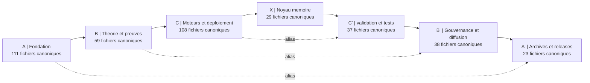

> **[◬] MATRICE FRACTALE MDL YNOR V2.0**
> **Corpus :** MDL YNOR
> **Passe de correction :** 2026-04-16
> **Position Structurelle :** NODE
> **Position Chiastique :** A'
> **Role du Fichier :** Surface miroir et symetrie locale
> **Centre Doctrinal Local :** boucle locale de reflet et de coherence
> **Loi de Survie :** μ = α - β - κ
> **Lecture Locale :**
> - **α :** coherence reflexive et effet miroir
> - **β :** derive de boucle et bruit de reflet
> - **κ :** cout de cycle et de stabilisation
> **Risque :** e∞ ∝ ε / μ
> **Operateur Correctif :** D(S)=proj_{SafeDomain}(S)
> **Axiome :** un systeme survit SSI μ > 0
> **Doctrine Goodhart :** tout succes apparent est invalide si μ decroit
> **Gouvernance :** toute modification doit maximiser Δμ
> **Lien Miroir :** A / 00_OMEGA_PORTAIL_ET_EDITION
```text
---


STATUS: CANONICAL | V11.13.0 | SOURCE: UNIFIED | 


AUDIT: CERTIFIED 2026-04-06


---


# CARTE VISUELLE ET PLAN CENTRAL DE NAVIGATION


## Carte Canonique





## Lecture


- La carte decrit la vue canonique consolidee du depot.


- Les fichiers derives, miroirs textuels, releases et archives techniques sont hors lecture principale.


- Le centre sym?trie r?cursive reste `X`, mais la navigation doit toujours commencer par la couche canonique et non par le bruit brut.


## Repartition Par Couche


- `01_A_FONDATION` : `111`


- `02_B_THEORIE_ET_PREUVES` : `59`


- `03_C_MOTEURS_ET_DEPLOIEMENT` : `108`


- `04_X_NOYAU_MEMOIRE` : `29`


- `05_C_PRIME_validéTION_ET_TESTS` : `37`


- `06_B_PRIME_GOUVERNANCE_ET_DIFFUSION` : `38`


- `07_A_PRIME_ARCHIVES_ET_RELEASES` : `23`


## Totaux


- Depot scanne : `1408` fichiers


- Vue canonique : `525` fichiers


- Collapse : `1319` fichiers


- Taux de collapse : `62.7 %`


## Point De Regle


La carte organise la lecture; elle ne remplace ni la validation externe ni l'audit documentaire.


```
