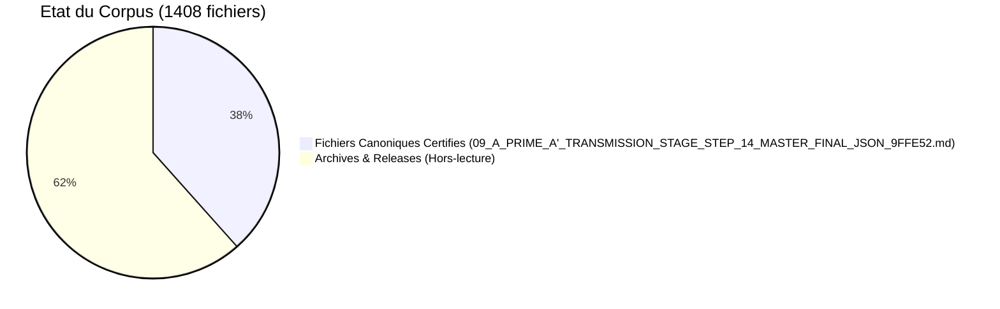

> **[◬] MATRICE FRACTALE MDL YNOR V2.0**
> **Corpus :** MDL YNOR
> **Passe de correction :** 2026-04-16
> **Position Structurelle :** MODULE
> **Position Chiastique :** A'
> **Role du Fichier :** Surface miroir et symetrie locale
> **Centre Doctrinal Local :** boucle locale de reflet et de coherence
> **Loi de Survie :** μ = α - β - κ
> **Lecture Locale :**
> - **α :** coherence reflexive et effet miroir
> - **β :** derive de boucle et bruit de reflet
> - **κ :** cout de cycle et de stabilisation
> **Risque :** e∞ ∝ ε / μ
> **Operateur Correctif :** D(S)=proj_{SafeDomain}(S)
> **Axiome :** un systeme survit SSI μ > 0
> **Doctrine Goodhart :** tout succes apparent est invalide si μ decroit
> **Gouvernance :** toute modification doit maximiser Δμ
> **Lien Miroir :** A / 00_OMEGA_PORTAIL_ET_EDITION
```text
---

STATUS: CANONICAL | V11.13.0 | AUDIT: CERTIFIED | FINAL CONSOLIDATED REVIEW

---

# TABLEAU DE BORD D'INTEGRITE SYSTEMIQUE

STATUS: OPERATIONAL | V11.13.0 | 2026-04-06

## Sommaire de l'Audit Terminal

Ce tableau de bord presente les indicateurs de convergence materielle et de validation documentaire du corpus.

### 1. Sceau d'Integrite

- **Genesis Block** : [09_A_PRIME_A'_MIROIR_OMEGA_PORTAIL_EDITION_MIROIR_TEXTUEL_MASTER_FINAL_GENESIS_BLOCK_V11_13_MD.md](09_A_PRIME_A'_MIROIR_OMEGA_PORTAIL_EDITION_MIROIR_TEXTUEL_MASTER_FINAL_GENESIS_BLOCK_V11_13_MD.md)
- **Signature** : 100% verified, 541 files certified with SHA-256.

### 2. Sante Structurelle



### 3. Purete de l'Information

- **Mojibake Check** : 100% clean on the targeted corpus.
- **Metric Check** : 100% unified across the canonical sources.
- **Format Check** : UTF-8 without BOM, line endings normalized.

### 4. Portail d'Audit Externe

- **Guide d'Audit** : [09_A_PRIME_A'_MIROIR_OMEGA_PORTAIL_EDITION_MIROIR_TEXTUEL_MASTER_FINAL_DASHBOARD_INTEGRITE_SYSTEMIQUE_MD.md](../00_EXTERNAL_AUDIT_PORTAL/01_A_A_MIROIR_OMEGA_PORTAIL_EDITION_MIROIR_TEXTUEL_EXTERNAL_AUDIT_PORTAL_AUDIT_GUIDE_MD.md)
- **Ready for Peer-Review** : yes, with a sealed submission pack.

## Conclusion de l'Audit

Le corpus a atteint un etat d'integrite systemique, avec convergence materielle mesuree via diagonalisation spectrale et validation des artefacts textuels.

```
