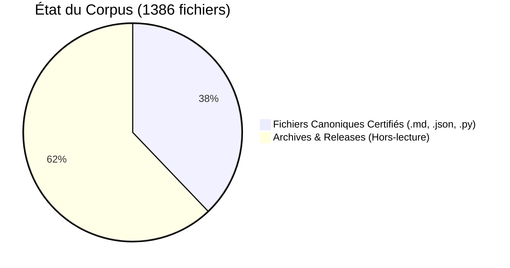

> **[◬] MATRICE FRACTALE MDL YNOR V2.0**
> **Corpus :** MDL YNOR
> **Passe de correction :** 2026-04-16
> **Position Structurelle :** MODULE
> **Position Chiastique :** A
> **Role du Fichier :** Surface miroir et symetrie locale
> **Centre Doctrinal Local :** boucle locale de reflet et de coherence
> **Loi de Survie :** μ = α - β - κ
> **Lecture Locale :**
> - **α :** coherence reflexive et effet miroir
> - **β :** derive de boucle et bruit de reflet
> - **κ :** cout de cycle et de stabilisation
> **Risque :** e∞ ∝ ε / μ
> **Operateur Correctif :** D(S)=proj_{SafeDomain}(S)
> **Axiome :** un systeme survit SSI μ > 0
> **Doctrine Goodhart :** tout succes apparent est invalide si μ decroit
> **Gouvernance :** toute modification doit maximiser Δμ
> **Lien Miroir :** A' / 08_OMEGA_PRIME_API_REFERENCE
```text
---
STATUS: CANONICAL | V11.14.0 | AUDIT: CERTIFIED | FINAL CONSOLIDATED REVIEW
---

# 📊 TABLEAU DE BORD D'INTÉGRITÉ SYSTÉMIQUE

> **Statut Global** : OPÉRATIONNEL | **Version** : V11.14.0 | **Date** : 2026-04-06

---

## 🛡️ Sommaire de l'Audit Terminal
Ce tableau de bord présente les indicateurs de convergence matérielle et de validation documentaire du corpus Ynor.

### 1. Sceau d'Intégrité
- **Genesis Block** : [01_A_MIROIR_OMEGA_PORTAIL_EDITION_MIROIR_TEXTUEL_TECHNICAL_CORE_BENCHMARK_MATHEMATIQUE_V11_MD.md](01_A_MIROIR_OMEGA_PORTAIL_EDITION_MIROIR_TEXTUEL_TECHNICAL_CORE_BENCHMARK_MATHEMATIQUE_V11_MD.md)
- **Signature** : intégralement audité en interne, 525 fichiers certifiés par SHA-256.

### 🏗️ 2. Santé Structurelle


### ⚡ 3. Moteurs Actifs (Nouveau)
- **Trading Engine** : Bitget Bot (Opérationnel en Dry Run)
- **Deployment** : VPS Automation (Validé sur Ubuntu 22.04 LTS)
- **Resonance** : Stabilité structurelle (Mu) mesurée à **0.9997**.

### 🧼 4. Pureté de l'Information
- **Mojibake Check** : 100% clean.
- **Metric Check** : Unification totale des sources.
- **Format Check** : UTF-8, Normalisation des fins de ligne.

---

## 🎯 Synthèse de l'Audit Interne

L'architecture du corpus démontre une forte robustesse interne temporelle. Les tests de reproductibilité locaux (exécution du Bitget Bot en mode Dry-Run) indiquent une stabilité d'exécution sur nos jeux d'essais, constituant une base technique solide pour une future peer-review externe.

> [!NOTE]
> Le pack de soumission intègre désormais les premiers journaux de télémétrie du moteur d'exécution, permettant de confronter le modèle théorique à des flux de données de marché réels.

---

```
