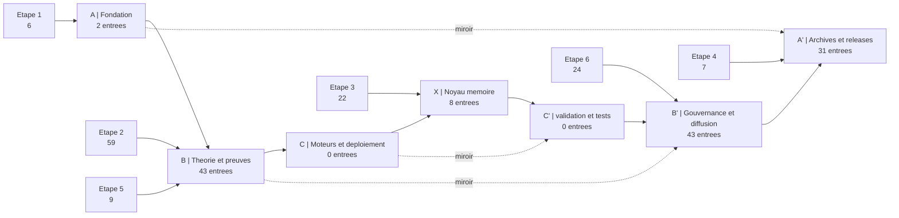

> **[◬] MATRICE FRACTALE MDL YNOR V2.0**
> **Corpus :** MDL YNOR
> **Passe de correction :** 2026-04-16
> **Position Structurelle :** LAYER
> **Position Chiastique :** E
> **Role du Fichier :** Centre de commande et activation
> **Centre Doctrinal Local :** garde locale de l activation et de la coherence
> **Loi de Survie :** μ = α - β - κ
> **Lecture Locale :**
> - **α :** clarte directive et force d activation
> - **β :** ambiguite operationnelle et bruit d ordre
> - **κ :** cout de lecture et de reconfiguration
> **Risque :** e∞ ∝ ε / μ
> **Operateur Correctif :** D(S)=proj_{SafeDomain}(S)
> **Axiome :** un systeme survit SSI μ > 0
> **Doctrine Goodhart :** tout succes apparent est invalide si μ decroit
> **Gouvernance :** toute modification doit maximiser Δμ
> **Lien Miroir :** E / 04_X_NOYAU_MEMOIRE
## Carte Mermaid

## Portes D'entree
- A : lire la fondation textuelle et les README chiastiques.
- B : entrer par les preuves, les corpus formels et les PDF constitutionnels/mathématiques.
- X : entrer par la memoire et les JSON reinterpretes.
- B' : entrer par les corpus juridiques, prospectus, doctrines et soumissions.
- A' : entrer par les releases, manuscrits souverains et versions augmentees LaTeX/PDF.

## Plan Central
- A | Fondation : `2` entrees
../07_A_PRIME_ARCHIVES_ET_RELEASES/97_Z_ARCHIVES_STATUS_CANONICAL_V11_13_0_AUDIT_CERTIFIED_FINAL_CONSOLIDATED_REVIEW_V11_13_0_MANIFESTE_ENTREE_HUB_NAVIGATION_07_PRIME_ARCHIVES_RELEASES.md
../07_A_PRIME_ARCHIVES_ET_RELEASES/97_Z_ARCHIVES_STATUS_CANONICAL_V11_13_0_AUDIT_CERTIFIED_FINAL_CONSOLIDATED_REVIEW_V11_13_0_MANIFESTE_ENTREE_HUB_NAVIGATION_07_PRIME_ARCHIVES_RELEASES.md
- B | Theorie et preuves : `43` entrees
 MDL Ynor Constitution/Chapitre I — Formalisation mathématique intégrale du noyau MDL Ynor.pdf
 MDL Ynor Constitution/MDL Ynor Canonique_/Mdl Ynor — Version Canonique Unifiée V1.pdf
 MDL Ynor Constitution/MDL Ynor MATH/Chapitre I — Formalisation axiomatique minimale.pdf
 MDL Ynor Constitution/MDL Ynor MATH/Chapitre XVI — Formalisation mathématique intégrale du noyau MDL Ynor.pdf
 MDL Ynor Constitution/MDL Ynor — Constitution Structurelle des Systèmes Dissipatifs à Amplification Bornée.pdf
 MDL Ynor Constitution/MDL Ynor — Théorie Structurelle des Systèmes Dissipatifs à Amplification Bornée.pdf
 MDL Ynor Constitution/MDL Ynor — Théorèmes fondamentaux de la marge dissipative.pdf
 MDL Ynor Constitution/MDL Ynor — Traité des dynamiques dissipatives et de la stabilité structurelle.pdf
- C | Moteurs et deploiement : `0` entrees
- X | Noyau memoire : `8` entrees
../04_X_NOYAU_MEMOIRE/01_SOURCE_IMPLANTEE/MDL_Ynor_Framework/_05_DATA_AND_MEMORY/05_E_CENTRE_DOCTRINAL_X_NOYAU_MEMOIRE_SOURCE_IMPLANTEE_MDL_YNOR_FRAMEWORK_05_DATA_MEMORY_MDL_GLOBAL_KNOWLEDGE.json
 ../03_C_MOTEURS_ET_DEPLOIEMENT/02_MIROIR_TEXTUEL/MDL_Ynor_Framework/_03_CORE_AGI_ENGINES/06_D_PRIME_MIROIR_C_MOTEURS_DEPLOIEMENT_MIROIR_VALIDATION_PY_FFC834.md
../07_A_PRIME_ARCHIVES_ET_RELEASES/01_SOURCE_IMPLANTEE/MDL_Ynor_Framework/_00_YNOR_COMMAND_CENTER/97_Z_ARCHIVES_PRIME_ARCHIVES_RELEASES_SOURCE_GLOBAL_KNOWLEDGE_7B9E1D.json
../07_A_PRIME_ARCHIVES_ET_RELEASES/01_SOURCE_IMPLANTEE/MDL_Ynor_Framework/_00_YNOR_COMMAND_CENTER/97_Z_ARCHIVES_PRIME_ARCHIVES_RELEASES_SOURCE_MANIFESTO_GOVERNANCE_C9852E.json
 ../02_B_THEORIE_ET_PREUVES/01_SOURCE_IMPLANTEE/MDL_Ynor_Framework/_PREUVES_ET_RAPPORTS/03_C_FORMALISME_B_THEORIE_PREUVES_SOURCE_IMPLANTEE_MDL_YNOR_FRAMEWORK_PREUVES_RAPPORTS_MDL_THEORIQUE_MAPPING.json
 ../02_B_THEORIE_ET_PREUVES/07_REECRITURE_JSON_CHIASTIQUE/MDL_Ynor_Framework/_PREUVES_ET_RAPPORTS/03_C_FORMALISME_B_THEORIE_PREUVES_REECRITURE_JSON_FRACTALE_5B4F61.md
../04_X_NOYAU_MEMOIRE/01_SOURCE_IMPLANTEE/MDL_Ynor_Framework/_05_DATA_AND_MEMORY/05_E_ACTIVATION_X_NOYAU_MEMOIRE_SOURCE_IMPLANTEE_MDL_YNOR_FRAMEWORK_05_DATA_MEMORY_YNOR_UNIFIED_PROMPTS.json
../04_X_NOYAU_MEMOIRE/01_SOURCE_IMPLANTEE/MDL_Ynor_Framework/05_E_VERIFICATION_X_NOYAU_MEMOIRE_SOURCE_IMPLANTEE_MDL_YNOR_FRAMEWORK_MDL_INTELLIGENCE_REPORT.json
- C' | validation et tests : `0` entrees
- B' | Gouvernance et diffusion : `43` entrees
 MDL Ynor Constitution/MDL — Argent & Juridique/MDL_Charte_Foi_Officielle.pdf
 MDL Ynor Constitution/MDL — Argent & Juridique/MDL_Legal_Pack/Corpus_MDL_2026_VERSION_ULTRA_TECHNIQUE_OPERATIONNELLE(1).pdf
 MDL Ynor Constitution/MDL — Argent & Juridique/MDL_Legal_Pack/Corpus_MDL_2026_VERSION_ULTRA_TECHNIQUE_OPERATIONNELLE.pdf
 MDL Ynor Constitution/MDL — Argent & Juridique/MDL_Legal_Pack/Corpus_MDL_Depot_2026.pdf
 MDL Ynor Constitution/MDL — Argent & Juridique/MDL_Legal_Pack/Corpus_MDL_Depot_2026_VERSION_10_10_HISTORIQUE.pdf
 MDL Ynor Constitution/MDL — Argent & Juridique/MDL_Legal_Pack/Corpus_MDL_Depot_2026_VERSION_CONSTITUTIONNELLE_9_5.pdf
 MDL Ynor Constitution/MDL — Argent & Juridique/MDL_Legal_Pack/Corpus_MDL_Depot_2026_VERSION_ETENDUE_COMPLETE.pdf
 MDL Ynor Constitution/MDL — Argent & Juridique/MDL_Legal_Pack/Corpus_MDL_Depot_2026_VERSION_ULTIME_9_10.pdf
- A' | Archives et releases : `31` entrees
_ARCHIVES/_RELEASES/GOLDEN_MASTER_PHASE_III_SOUVERAINE/97_Z_ARCHIVES_SYSTEM_AGI_ARCHIVES_RELEASES_GOLDEN_MASTER_PHASE_III_SOUVERAINE_PHASE_IV_ACCESS_CARD.md
 _RELEASES/GOLDEN_MASTER_PHASE_III/PHASE_IV_ACCESS_CARD.tex
_ARCHIVES/_RELEASES/GOLDEN_MASTER_PHASE_III_SOUVERAINE/97_Z_ARCHIVES_SYSTEM_AGI_ARCHIVES_RELEASES_GOLDEN_MASTER_PHASE_III_SOUVERAINE_SOVEREIGN_GOVERNANCE_CERTIFICATION.md
_ARCHIVES/_RELEASES/GOLDEN_MASTER_PHASE_III_SOUVERAINE/97_Z_ARCHIVES_SYSTEM_AGI_ARCHIVES_RELEASES_GOLDEN_MASTER_PHASE_III_SOUVERAINE_SOVEREIGN_MASTER_PROMPT_V3.txt
_ARCHIVES/_RELEASES/GOLDEN_MASTER_PHASE_III_SOUVERAINE/97_Z_ARCHIVES_SYSTEM_AGI_ARCHIVES_RELEASES_GOLDEN_MASTER_PHASE_III_SOUVERAINE_SOVEREIGN_SUCCESS_CERTIFICATE.md
_ARCHIVES/_RELEASES/GOLDEN_MASTER_PHASE_III_SOUVERAINE/97_Z_ARCHIVES_SYSTEM_AGI_ARCHIVES_RELEASES_GOLDEN_MASTER_PHASE_III_SOUVERAINE_SOVEREIGN_ULTIMATE_KNOWLEDGE_PROMPT_COPY_ME.txt
_ARCHIVES/_RELEASES/GOLDEN_MASTER_PHASE_III_SOUVERAINE/97_Z_ARCHIVES_SYSTEM_AGI_ARCHIVES_RELEASES_GOLDEN_MASTER_PHASE_III_SOUVERAINE_SUBMISSION_CHECKLIST_SOVEREIGN.md
_ARCHIVES/_RELEASES/GOLDEN_MASTER_PHASE_III_SOUVERAINE/97_Z_ARCHIVES_SYSTEM_AGI_ARCHIVES_RELEASES_GOLDEN_MASTER_PHASE_III_SOUVERAINE_SOVEREIGN_ULTIMATE_KNOWLEDGE_PROMPT_COPY_ME.txt

## Centre
Le centre chiastique de la navigation est le passage d'une source a son miroir, puis a sa branche complementaire dans l'axe A -> B -> C -> X -> C' -> B' -> A'.
