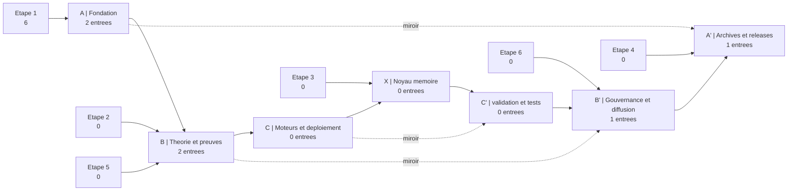

> **[◬] MATRICE FRACTALE MDL YNOR V2.0**
> **Corpus :** MDL YNOR
> **Passe de correction :** 2026-04-16
> **Position Structurelle :** NODE
> **Position Chiastique :** E
> **Role du Fichier :** Transmission et interface
> **Centre Doctrinal Local :** canal local de diffusion et de synchronisation
> **Loi de Survie :** μ = α - β - κ
> **Lecture Locale :**
> - **α :** portee de diffusion et memoisation utile
> - **β :** perte de fidelite et dispersion
> - **κ :** cout de packaging et de synchronisation
> **Risque :** e∞ ∝ ε / μ
> **Operateur Correctif :** D(S)=proj_{SafeDomain}(S)
> **Axiome :** un systeme survit SSI μ > 0
> **Doctrine Goodhart :** tout succes apparent est invalide si μ decroit
> **Gouvernance :** toute modification doit maximiser Δμ
> **Lien Miroir :** E / 04_X_NOYAU_MEMOIRE
## Carte Mermaid

## Portes D'entree
- A : lire la fondation textuelle et les README chiastiques.
- B : entrer par les preuves, les corpus formels et les PDF constitutionnels/mathématiques.
- X : entrer par la memoire et les JSON reinterpretes.
- B' : entrer par les corpus juridiques, prospectus, doctrines et soumissions.
- A' : entrer par les releases, manuscrits souverains et versions augmentees LaTeX/PDF.

## Plan Central
- A | Fondation : `2` entrees
../../../../05_C_PRIME_VALIDATION_ET_TESTS/01_SOURCE_IMPLANTEE/MDL_Ynor_Framework/.pytest_cache/06_D_PRIME_ROOT_PYTEST_CACHE_DIRECTORY_MANIFESTE_PYTEST_CACHE_463436.md
../../../../05_C_PRIME_VALIDATION_ET_TESTS/01_SOURCE_IMPLANTEE/MDL_Ynor_Framework/.pytest_cache/06_D_PRIME_ROOT_PYTEST_CACHE_DIRECTORY_MANIFESTE_PYTEST_CACHE_463436.md
- B | Theorie et preuves : `2` entrees
../../../../02_B_THEORIE_ET_PREUVES/01_SOURCE_IMPLANTEE/MDL_Ynor_Framework/_01_THEORY_AND_PAPERS/03_C_FORMALISME_B_THEORIE_PREUVES_SOURCE_IMPLANTEE_MDL_YNOR_FRAMEWORK_01_THEORY_PAPERS_COMPARATIVE_WORKS.md
../../../_ARCHIVES/_RELEASES/GOLDEN_MASTER_PHASE_III_SOUVERAINE/97_Z_ARCHIVES_SYSTEM_AGI_ARCHIVES_RELEASES_GOLDEN_MASTER_PHASE_III_SOUVERAINE_SOVEREIGN_SCIENTIFIC_WHITE_PAPER_V3.md
- C | Moteurs et deploiement : `0` entrees
- X | Noyau memoire : `0` entrees
- C' | validation et tests : `0` entrees
- B' | Gouvernance et diffusion : `1` entrees
../../../../06_B_PRIME_GOUVERNANCE_ET_DIFFUSION/01_SOURCE_IMPLANTEE/_SUBMISSIONS/07_C_PRIME_TRANSMISSION_B_PRIME_GOUVERNANCE_DIFFUSION_SOURCE_IMPLANTEE_SUBMISSIONS_SUBMISSION_CHECKLIST.md
- A' | Archives et releases : `1` entrees
../../../_ARCHIVES/_RELEASES/GOLDEN_MASTER_PHASE_III_SOUVERAINE/97_Z_ARCHIVES_SYSTEM_AGI_ARCHIVES_RELEASES_GOLDEN_MASTER_PHASE_III_SOUVERAINE_SOVEREIGN_MASTER_PROMPT_V3.txt

## Centre
Le centre chiastique de la navigation est le passage d'une source a son miroir, puis a sa branche complementaire dans l'axe A -> B -> C -> X -> C' -> B' -> A'.
