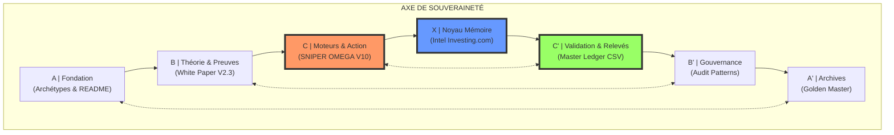

> **[◬] MATRICE FRACTALE MDL YNOR V2.0**
> **Corpus :** MDL YNOR
> **Passe de correction :** 2026-04-16
> **Position Structurelle :** MODULE
> **Position Chiastique :** B'
> **Role du Fichier :** Prompt systeme et activation
> **Centre Doctrinal Local :** garde locale de l activation et de la coherence
> **Loi de Survie :** μ = α - β - κ
> **Lecture Locale :**
> - **α :** clarte directive et force d activation
> - **β :** ambiguite operationnelle et bruit d ordre
> - **κ :** cout de lecture et de reconfiguration
> **Risque :** e∞ ∝ ε / μ
> **Operateur Correctif :** D(S)=proj_{SafeDomain}(S)
> **Axiome :** un systeme survit SSI μ > 0
> **Doctrine Goodhart :** tout succes apparent est invalide si μ decroit
> **Gouvernance :** toute modification doit maximiser Δμ
> **Lien Miroir :** B / 01_A_FONDATION
## 🌌 Navigation Chiastique (V10.0)

## 🎯 Accès Rapides (Missions Actives)
- **[C] EXECUTION SNIPER** : [[05_E_VERIFICATION_SYSTEM_AGI_FRACTAL_CHIASTE_UNIVERSEL_INDEX_MAITRE_FRACTAL_CHIASTIQUE.md]]
- **[X] INTEL MONDIALE** : [[../../04_X_NOYAU_MEMOIRE/WORLD_GEOPOLITICS_NEXUS/05_E_VERIFICATION_X_NOYAU_MEMOIRE_WORLD_GEOPOLITICS_NEXUS_INVESTING_FULL_REPORT.json]]
- **[C'] AUDIT LEDGER** : [[05_E_TRANSMISSION_STEP_7_MASTER_INDEX_MANIFESTE_DISTRIBUTION_SUIVI_SYSTEM_AGI_FRACTAL_CHIASTE_UNIVERSEL_STEP7_MASTER_INDEX.json]]

## 📚 Fondation Théorique
- **[A] FRAMEWORK** : [[../../01_A_FONDATION/01_SOURCE_IMPLANTEE/MDL_Ynor_Framework/02_B_CONSTITUTION_FONDATION_SOURCE_IMPLANTEE_MDL_YNOR_FRAMEWORK_YNOR_FULL_CORPUS_FORMAL_SPEC_V2_3.md]]
- **[B] COMPLEMENTS** : [[../_ARCHIVES/_RELEASES/GOLDEN_MASTER_PHASE_III_SOUVERAINE/97_Z_ARCHIVES_SYSTEM_AGI_ARCHIVES_RELEASES_GOLDEN_MASTER_PHASE_III_SOUVERAINE_SOVEREIGN_SCIENTIFIC_WHITE_PAPER_V3.md]]

---
*μ = 1.0 | Système MDL Ynor Scellé et Auditable*
